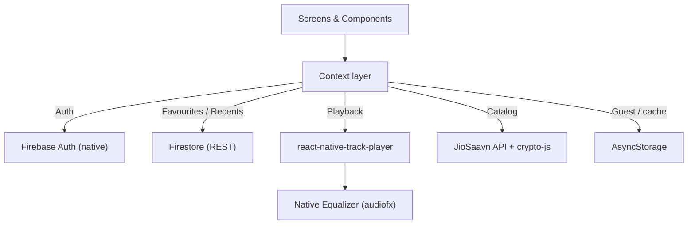

<div align="center">

# 🎵 Dhun

### *Feel every beat.*

A polished, multi‑language music streaming app built with **React Native** — mainstream **Hindi · Punjabi · English · Tamil · South (Telugu/Tamil/Kannada/Malayalam) · Bhojpuri · Marathi** songs, real **320 kbps** streaming, a working **equalizer**, per‑song **reactive theming**, cloud **login from any device**, and a **Creator Studio** for your own uploads.

`React Native 0.86` · `New Architecture` · `Firebase Auth` · `JioSaavn` · `Android`

</div>

---

## ✨ Highlights

| | Feature |
|---|---|
| 🌍 | **7 language feeds** + a combined **South** section, powered by live JioSaavn trending charts |
| 🎧 | **True 320 kbps** full‑track streaming (DES‑decrypted media URLs) |
| 🎚️ | **Real equalizer** — 5 bands + 15 presets + bass boost (native `audiofx`) |
| 🎨 | **Reactive UI** — the whole player recolors to each song |
| 📊 | **Animated visualizer** that pulses with playback |
| ☁️ | **Cloud accounts** — sign in from any device (Firebase Auth + Firestore) |
| 🙅 | **Guest mode** — use everything without an account |
| ▶️ | Background playback, lock‑screen controls, mini‑player, shuffle / repeat / sleep‑timer / speed |
| 🎙️ | **Creator Studio** — add your own audio files to a playable library |
| 💫 | Animated splash, smooth transitions & entrance animations |

---

## 📱 Screens

`Splash → Login / Guest` · `Home (language feeds)` · `Search` · `Now Playing` · `Equalizer` · `Library (liked + recent)` · `Creator Studio` · `Profile`

---

## 🏗️ Architecture



**State is organised into focused React Contexts:**

| Context | Responsibility | Backend |
|---------|----------------|---------|
| `AuthContext` | login / register / guest | Firebase Auth (cloud) + AsyncStorage (guest) |
| `LibraryContext` | favourites + recently played | Firestore REST (users) / AsyncStorage (guests) |
| `UploadsContext` | Creator uploads | AsyncStorage + device file cache |
| `PlayerContext` | playback, theme, shuffle/repeat/sleep/speed | react-native-track-player |

---

## 🧱 Tech stack

| Area | Choice |
|------|--------|
| Framework | React Native 0.86 (bare CLI, New Architecture / bridgeless) |
| Navigation | React Navigation (native-stack + bottom-tabs) |
| Audio engine | react-native-track-player 4.1.2 *(patched for New Arch)* |
| Equalizer | Custom Kotlin module over `android.media.audiofx` |
| Catalog | JioSaavn public web API (free, no key) |
| Media decryption | crypto-js (DES‑ECB, pure JS) |
| Auth | @react-native-firebase/auth |
| Cloud DB | Firestore via REST |
| Local storage | @react-native-async-storage/async-storage |
| File picker | @react-native-documents/picker |
| UI | linear-gradient · slider · vector-icons · Animated |

---

## 📁 Project structure

```
src/
├── api/jiosaavn.js            # trending per language, search, DES stream-url decryption
├── firebase/firestoreRest.js  # Firestore REST helper (ID-token auth)
├── native/Equalizer.js        # JS wrapper for the native EQ + presets
├── theme/{theme,songTheme}.js # design tokens + per-song reactive palette
├── context/{Auth,Library,Uploads,Player}Context.js
├── player/setupPlayer.js
├── navigation/RootNavigator.js
├── screens/{Home,Search,Creator,Library,Player,Equalizer,Profile}Screen.js
│   └── auth/{Login,Register}Screen.js
├── components/{SplashScreen,FadeIn,MiniPlayer,Visualizer,TrackRow,TrackCard,...}.js
└── hooks/usePlay.js
android/app/src/main/java/com/hiresmusic/equalizer/   # native EQ module + package
service.js                     # RNTP headless service (remote/lock-screen controls)
```

---

## 🚀 Getting started

**Prerequisites:** Node ≥ 20, JDK 17, Android SDK, an emulator or device.

```bash
npm install          # also applies the RNTP New-Arch patch (postinstall)
npm start            # Metro bundler
npm run android      # build & install on device/emulator
```

> JioSaavn requests send a browser `User-Agent` (it 403s otherwise) — already handled in `api/jiosaavn.js`.

---

## 🔐 Firebase setup (for cloud login)

1. Create a Firebase project and add an **Android app** with package `com.hiresmusic`.
2. Enable **Authentication → Email/Password**.
3. Create **Firestore Database**.
4. Download **`google-services.json`** into `android/app/`.
5. Rebuild. Recommended Firestore security rule:

```
match /users/{uid} {
  allow read, write: if request.auth != null && request.auth.uid == uid;
}
```

Guests work fully offline without any of this.

---

## 🩹 Engineering notes

- **RNTP × New Architecture** — `react-native-track-player@4.1.2` predates RN 0.86's mandatory New Architecture. A shipped patch (`patches/…`, auto‑applied by `patch-package`) fixes nullable `Bundle` args, coroutine `Job` return types on async `@ReactMethod`s, and bridgeless event emission via `ReactHost`.
- **Firestore over REST** — the native Firestore module's codegen produces file paths beyond Windows' 260‑char limit on deep folders, so favourites use the Firestore REST API (authenticated with the Firebase ID token) instead.

---

## 🗺️ Roadmap

- [ ] Lyrics (synced) on the player
- [ ] Custom playlists + drag‑to‑reorder queue
- [ ] Cloud uploads (Firebase Storage) + Google sign‑in
- [ ] True artwork‑based colors, crossfade, offline downloads
- [ ] iOS build

---

<div align="center">

Built with ❤️ · Catalog by JioSaavn · Not affiliated with any music label

</div>
